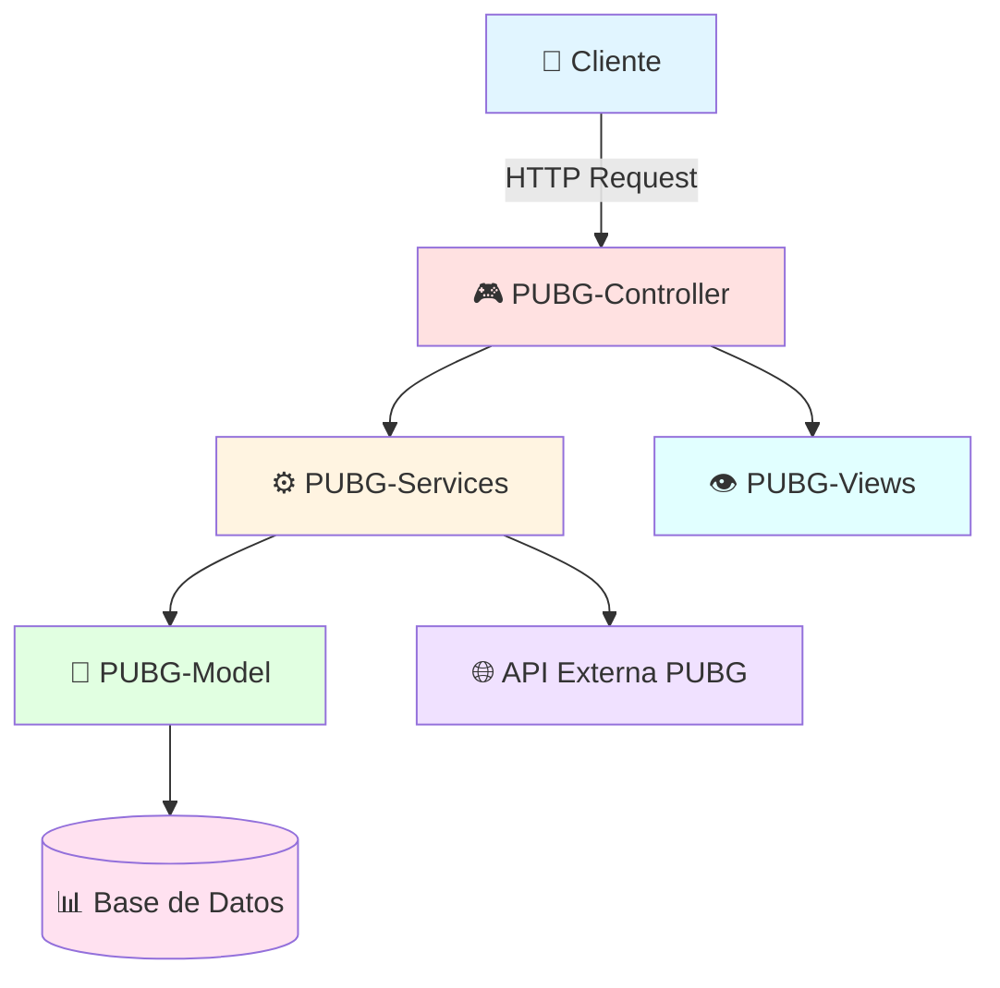

<div align="center">

# 🎮 API-PUBG


[](https://github.com/Yonderus/API-PUBG/stargazers)
[](https://github.com/Yonderus/API-PUBG/network)
[](https://github.com/Yonderus/API-PUBG/issues)
[](LICENSE)

### 🚀 A powerful C# ASP.NET Core API for PUBG game data integration

[Características](#-características) •
[Instalación](#-instalación) •
[Uso](#-uso) •
[Arquitectura](#-arquitectura) •
[Contribuir](#-contribuir)

</div>

---

## 📖 Descripción

<div align="center">

</div>

**API-PUBG** es un servicio backend robusto desarrollado con **C#** y **ASP.NET Core**, diseñado para servir y gestionar datos relacionados con PlayerUnknown's Battlegrounds (PUBG). Proporciona una forma estructurada de acceder a estadísticas de juego, perfiles de jugadores, datos de partidas y otra información relacionada con el juego.

Ideal para:
- 📊 Herramientas de análisis de datos
- 🎯 Aplicaciones companion
- 🌐 Interfaces web personalizadas
- 📈 Dashboards de estadísticas

---

## ✨ Características

<details open>
<summary><b>Ver todas las características</b></summary>
<br>

| Característica | Descripción |
|:---:|:---|
| 🎯 | **Integración PUBG**: Interacción fluida con datos del juego |
| 🌐 | **API RESTful**: Endpoints limpios y bien definidos |
| 💾 | **Modelos de Datos**: Estructuras para jugadores, partidas y estadísticas |
| ⚙️ | **Lógica de Servicios**: Capa de negocio encapsulada y mantenible |
| 🔄 | **Arquitectura Extensible**: Fácil expansión de funcionalidades |
| 🛡️ | **Type-Safe**: Aprovecha el tipado fuerte de C# |
| ⚡ | **Alto Rendimiento**: Optimizado con ASP.NET Core |
| 📦 | **Modular**: Separación clara de responsabilidades |

</details>

---

## 🛠️ Tech Stack

<div align="center">


</div>

---

## 🚀 Instalación

### Prerrequisitos

```bash
✅ .NET SDK 8.0 o superior
✅ Visual Studio 2022 / VS Code / Rider
✅ Git
```

### Pasos de Instalación

<details open>
<summary><b>1️⃣ Clonar el repositorio</b></summary>

```bash
git clone https://github.com/Yonderus/API-PUBG.git
cd API-PUBG
```
</details>

<details>
<summary><b>2️⃣ Restaurar dependencias</b></summary>

```bash
dotnet restore
```
</details>

<details>
<summary><b>3️⃣ Configurar variables de entorno</b></summary>

```bash
# Crear archivo appsettings.json con tu configuración
cp appsettings.example.json appsettings.json
```
</details>

<details>
<summary><b>4️⃣ Compilar el proyecto</b></summary>

```bash
dotnet build
```
</details>

<details>
<summary><b>5️⃣ Ejecutar la aplicación</b></summary>

```bash
dotnet run
```
</details>

---

## 🎯 Uso

### Ejemplo de Petición API

```csharp
// GET: api/players/{playerName}
GET https://localhost:5001/api/players/YONDERUS
```

### Respuesta Esperada

```json
{
  "playerId": "12345",
  "playerName": "YONDERUS",
  "stats": {
    "kills": 150,
    "deaths": 75,
    "wins": 20,
    "kd_ratio": 2.0
  }
}
```

---

## 🏗️ Arquitectura

<div align="center">



</div>

### Estructura del Proyecto

```
API-PUBG/
├── 📁 PUBG-Controller/     # Controladores de API (Endpoints)
├── 📁 PUBG-Model/          # Modelos de datos y entidades
├── 📁 PUBG-Services/       # Lógica de negocio y servicios
├── 📁 PUBG-Views/          # Vistas y DTOs
├── 📄 API PUBG.sln         # Archivo de solución
└── 📄 README.md            # Este archivo
```

---

## 🤝 Contribuir

<div align="center">

Las contribuciones son **bienvenidas** y **apreciadas** 🎉

</div>

### Proceso de Contribución

1. 🍴 Fork el proyecto
2. 🌿 Crea tu Feature Branch (`git checkout -b feature/AmazingFeature`)
3. 💾 Commit tus cambios (`git commit -m 'Add: nueva característica increíble'`)
4. 📤 Push a la Branch (`git push origin feature/AmazingFeature`)
5. 🔀 Abre un Pull Request

### Convenciones de Commits

```
feat: Nueva característica
fix: Corrección de bug
docs: Cambios en documentación
style: Formato, punto y coma faltantes, etc
refactor: Refactorización de código
test: Añadir tests
chore: Actualizar tareas de build, configuración, etc
```

---

## 📊 Estadísticas del Proyecto

<div align="center">


</div>

---

## 📝 Licencia

Este proyecto está bajo la Licencia MIT. Ver el archivo `LICENSE` para más detalles.

---

## 👨‍💻 Autor

<div align="center">

**Yonderus**

[](https://github.com/Yonderus)

</div>

---

<div align="center">

### ⭐ Si te gustó este proyecto, considera darle una estrella!


**Hecho con ❤️ y C#**

</div>
